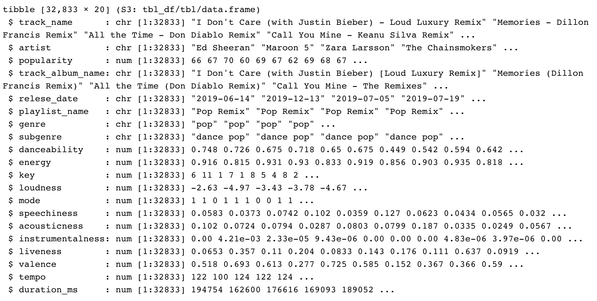
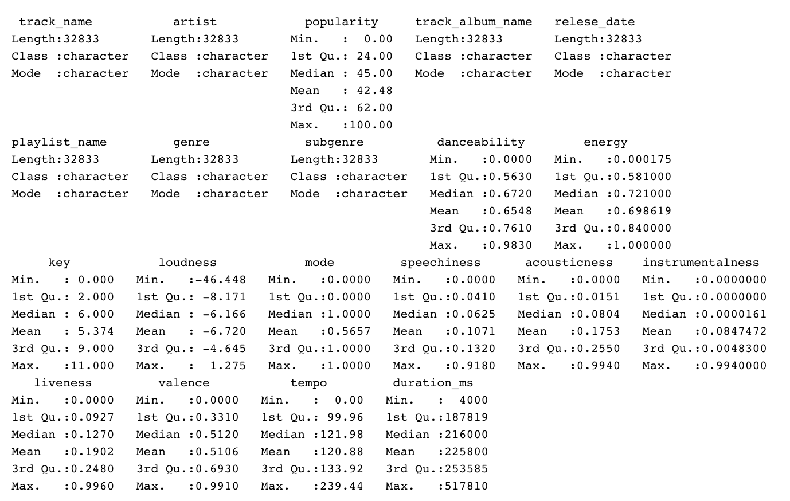

# Project Proposal 

## 0. Brief Overview of what we are going to do 
- Look at the evolution of music genre trends over the last century. 
- To assess the evolution of different music genres, in the U.S., over the last century by looking at the number of streams regarding that particular genre over time. 
- See the trends regarding each genre

## 1. Project title & Team Information
### Project name: Music Trends
### Group members: 
- Faiza Niazi, fn8788a@student.american.edu 
- Sem Lukichev, sl8139a@student.american.edu 
- Jaehee Lee, jl8883a@student.american.edu

## 2. Domain and Data

### Data Preparation 

<dl>
  <dt> A brief description of the domain - what is it, and why do people care about it? </dt> 
  <dd> This dataset is a collection of over 30,000 songs taken from Spotify. Music has always played a crucial role in human culture and traditions and will continue to do so. Gaining insight into how music has changed over time would be something people care about. </dd>

  <dt> A description and link to the dataset. </dt> 
  <dd>The data that we are going to use is dervied from Spotify via the spotifyr package. Charlie Thompson, Josiah Parry, Donal Phipps, and Tom Wolff authored this package to make it easier to get our own data or general metadata arounds songs from Spotify's API.  </dd> 
</dl> 

- [Link to the dataset](https://github.com/rfordatascience/tidytuesday/blob/master/data/2020/2020-01-21/readme.md)
- [spotifyr](https://www.rcharlie.com/spotifyr/)

<dl> 
  <dt> What type of dataset is it? </dt> 
  <dd> This is table dataset, we have our dataset in csv file format </dd> 
  <dd> The Spotify data used for this project is a dataset of over 30,000 songs with 12 audio features for each track, including measures like acousticness,liveness, speechiness and instrumentalness, perceptual measures like energy, loudness, danceablity and valence (positiveness), and descriptors like duration,key, tempo and mode. This dataset also includes other variables such as date, song name, artist, etc. </dd> 
  
  <dt> What are the items and attributes? </dt> 
 

  <dt> How big is it (number of items and attributes)? </dt> 
  <dd> There are 32,833 observations </dd> 
  <dd> There are 20 variables </dd> 
  
  <dt> Do you have it in hand already, and if not, why not? </dt> 
  <dd> Yes, our team have the data for our own. We derived dataset from tidytuesday github and removed unnecessary variables and renamed the variable names so that it is clear for us to analyze later. Then we saved that using write_csv in R and saved and uploaded the file to the data folder. Inside data folder we have a file called spotify_music_data.csv </dd> 
  <dd> However, we can clean this dataset more if we have to </dd> 
  
  
- [spotify music dataset](https://github.com/jaehee99/CSC_485_Music_Project/tree/main/data)

</dl>

## 3. Related Work
##### We found 4 significant projects or papers and described how they are relevant to our topic.

1. [The Development Trend of Musicians' Influence and Music Genres
of Big Data](https://www.proquest.com/openview/17bb5be076553ced83db813f341274a9/1?pq-origsite=gscholar&cbl=2040555)
- Description: Throughout this article authors, Zhang Xi chun and He Li, display the trends, regarding the influence of populars artists(i.e. The Beatles, Bob Dylan, and etc,), with regards to pop/rock and country genres, and how this has evolved overtime. They do so by taking survey responses, from the website AllMusic, and forming them into a variety of different idioms(i.e. line charts, neural networks, and etc.). With that being said, this article really gave our group a sense of how we can approach this topic(i.e. Gave us an idea of what kinds of idioms we could use, the different operations or ineractivity we could implement, and etc.).

2. [Gaining Musical Insights: Visualizing Multiple](https://www.medien.ifi.lmu.de/pubdb/publications/pub/chen2010VISSW/chen2010VISSW.pdf)
- Description: 

3. [The Evolution of Music Genre Popularity](https://thedataface.com/2016/09/culture/genre-lifecycles)
- Description: This article looks at the popularity of music genres overtime and it does so by taking data from the Billboard 100, dating back from 1964 to 2016, and formats this data in a way where the idioms(i.e. Tree maps and line charts) show the user the number of listeners/popularity each genre has overtime. That being said, this article is very similar to our topic in the sense that it also looks at the impact of genres overtime, and, for this reason, we also look to it as a frame of refrence even though we are planning on utilizing a different dataset and idioms.     

4. [Exploring the Tale of Music Through Data Visualization](https://www.analyticsvidhya.com/blog/2020/12/exploring-the-tale-of-music-through-data-visualization/)
- Description: This article shows the interactive plot (The x-axis describes mean popularity of songs assessed on a scale of 0 to 100. 0 means the song is least popular and 100 means it is most popular. The y-axis shows the number of songs produced in each genre. The size of the bubble describes the number of artists producing music in each genre.) It's not exactly the same, but it gave us the idea that we could make interactive plots like this.

## 4. Initial Sketches
### Sheet 1: Brainstorming

### Sheets 2, 3, 4: Details for three separate ideas

### Sheet 5: Realization
